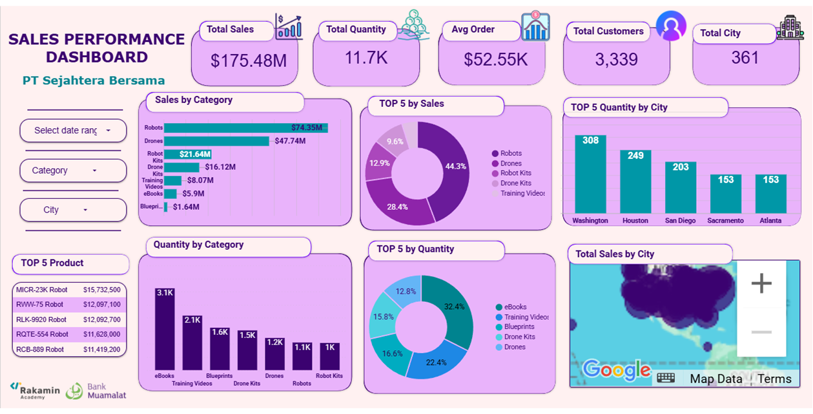

# Business Intelligence Sales Analysis

Business Intelligence sales analysis project completed as part of the **Project-Based Virtual Internship Program** by **Bank Muamalat x Rakamin Academy**.

This project focuses on transforming raw sales data into actionable business insights through data cleaning, SQL analysis, and interactive dashboard visualization.

## 📌 Project Overview

The objective of this project was to analyze over **3,000 sales transactions** to identify sales performance, customer behavior, and product trends. The analysis was conducted using **Microsoft Excel**, **SQL (BigQuery)**, and **Google Looker Studio**, followed by business recommendations to support strategic decision-making.

---

## 🎯 Business Objectives

- Analyze overall sales performance.
- Identify top-performing products and cities.
- Evaluate customer purchasing behavior.
- Develop interactive business dashboards.
- Provide data-driven business recommendations.

## Dataset

**Source**

Project-Based Virtual Internship – Bank Muamalat x Rakamin Academy

**Dataset Size**

- 3,000+ sales transactions
- Simulated retail sales data

## 🧹 Data Preparation
The dataset was prepared through several preprocessing steps, including:
- Cleaning missing and inconsistent values
- Standardizing data format
- Building SQL master tables
- Aggregating sales data using SQL queries
- Preparing clean datasets for dashboard visualization

## 🛠 Tools & Technologies

- Microsoft Excel
- SQL (Google BigQuery)
- Google Looker Studio

## 📸 Dashboard Preview


## 📊 Dashboard Features
The interactive dashboard includes:
- Total Sales
- Total Quantity Sold
- Average Order Value
- Total Customers
- Total Cities
- Sales by Product Category
- Top 5 Products
- Top 5 Cities
- Quantity Distribution
- Geographic Sales Distribution
- Interactive Filters (Date, Category, City)

## 💡 Key Business Insights
- Digital products generated the highest sales volume.
- Robots and Drones contributed the highest revenue despite lower quantities sold.
- Washington, Houston, and San Diego recorded the highest sales activity.
- High-value products present strong opportunities for upselling and cross-selling strategies.

## 🚀 Business Recommendations
Based on the analysis, several recommendations were proposed:
- Increase digital product bundling to maximize transaction volume.
- Implement cross-selling strategies for premium products.
- Focus marketing campaigns on high-performing cities.
- Bundle complementary products to improve Average Order Value (AOV).

## 🌐 Interactive Dashboard
View the interactive dashboard here:
**https://datastudio.google.com/u/0/reporting/5644f47b-6dbe-49df-b021-2cb2f47c4aa8/page/dQvnF**

## 📁 Repository Contents

```
README.md
Sales_Dataset.csv
Sales_Analysis_SQL_Query.sql
Dashboard_Sales_Performance_Bank_Muamalat_Preview.png
